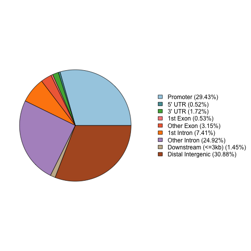

##ChIP-seq Intro  

 
author:MRC CSC Bioinformatics Core 
date:[http://bioinformatics.csc.mrc.ac.uk/training.html] 
width: 1440 
height: 1100 
autosize: true 
font-import: <link href='http://fonts.googleapis.com/css?family=Slabo+27px' rel='stylesheet' type='text/css'> 
font-family: 'Slabo 27px', serif; 
css:style.css 
 
##ChIP-seq introduction  

 
 
Chromatin precipitation followed by deep sequencing (**ChIP-seq**) is a well established technique which allows for the genome wide identification of transcription factor binding sites and epigenetic marks.  
 
 
 
 
 
##ChIP-seq introduction (continued) 

 
In this course we will use a few of the packages from the comprehensive repository available from the [Bioconductor project](https://www.bioconductor.org/). 
 
We will cover some of the basics of quality control, working with peaks, motif identification and functional analysis.  
 
For more details on alignment, working with coverage and peak calling you can join us on our extended course and/or find some information here. 
## 

 
 
* Where to find more information. 
* [ChIP-seq file types covered](#/filetypes). 
* [Story so far](#/background). 
* [Materials](#/materials). 
* [Assessing ChIP-seq quality](#/qc). 
* [Working with Peaks](#/peakpushing). 
* [Functional Annotation of peaks](#/functional). 
* [Denovo motifs](#/motifs). 
* [Differential ChIP-seq](#/diffchip). 
* [Getting hold of external data](#/external). 
* [Exporting data for Visualisation](#/viz). 
 
##Reminder of file types 

 
id: filetypes 
 
In this session we will be dealing with two data types, 
 
* [BED/BED6 files](http://mrccsc.github.io/genomicFormats.html#/18). 
 
* [FASTA files](http://mrccsc.github.io/genomicFormats.html#/6). 
 
##Reminder of file types - BED files 

 
 
* BED or BED 6 files are used to store genomic locations.  
* A mimimum requirement is chromosome,start and end positions for intervals. 
* BED6 can additionally store interval name, score and strand. 
 
 
 
 
##Reminder of file types - FASTA files 

 
 
* FASTA files store sequence information alongside names for stored sequences. 
* Lines starting with ">" contains name and/or information on sequence. 
* Lines following contain contig sequence 
 
 
 
##Story so far. 

 
id: background 
 
In this course we will use some of the Encode data for Myc ChIP-seq in mouse aligned to the mm9 genome. 
 
This data is composed of Myc chip for two cell lines, Mel and Ch12 cell lines, each with two replicates. 
 
Due to the short time we have together the data will be already processed from unaligned reads to called peaks.  
 
For full details on the analysis/processing of this data with all analysis steps covered in R/Bioconductor you can visit our course at WEBSITELINK. 
 
##Materials. 

 
id: materials 
 
All material for this course can be found on github. 
* [short_ChIPseq](https://github.com/ThomasCarroll/short_ChIPseq/) 
 
Or can be downloaded as a zip archive from here.  
* [Download zip](https://github.com/ThomasCarroll/short_ChIPseq/archive/2f6bc2972c80bb53ad9c59305ceeab5a76d597cd.zip) 
 
##Materials. - Presentations, source code and practicals. 

 
 
Once the zip file in unarchived. All presentations as HTML slides and pages, their R code and HTML practical sheets will be available in the directories underneath. 
 
* **presentations/slides/** 
Presentations as an HTML slide show. 
* **presentations/singlepage/**  
Presentations as an HTML single page. 
* **presentations/rcode/** 
R code in presentations. 
* **presentations/practicals/** 
Practicals as an HTML page.  
 
##Materials. - Data for presentations, practicals. 

 
 
All data to run code in the presentations and in the practicals is available in the zip archive. This includes raw data (MACS peak calls) as well R objects containing pre-compiled results. 
 
**data/Macs_peaks/** 
- MACS peak calls for 4 Myc ChIP-seq ending in *"_peaks.xls"* 
+ 2 replicates of Myc ChIP from Mel cell-line (mycmelrep1,mycmelrep1)  
+ 2 replicates of Myc ChIP from Ch12 cell-line (mycch12rep1,mycch12rep1) 
 
**data/robjects/** 
- Robjects for further analysis or review 
 
 
##Quality Control. 

 
id: qc 
 
ChIP-seq has many sources of potential noise including  
* Varying efficiency of antibodies 
* Non-specific binding 
* Library complexity 
* ChIP artefacts and background. 
 
Many of these sources of noise can be assessed using some now well-established methodology. 
 
##Quality Control - Quality metrics for ChIP-seq. 

 
 
The ChIPQC package wraps some of the metrics into a Bioconductor package and takes care to measure these metrics under the approriate condition.  
 
To run a single sample through ChIPQCsample function, we must provide the a set of peaks, the relevant unfiltered BAM file and we are recommended to supply a **blacklist** GRanges and Genome name. 
 
 
```r 
QCresult <- ChIPQCsample(reads="/pathTo/myChIPreads.bam", 
                         peaks="/pathTo/myChIPpeaks.bed", 
                         genome="mm9", 
                         blacklist = "/pathTo/mm9_Blacklist.bed") 
``` 
 
##Quality Control  

 
 
Although we may not have time in this practical, we can look at the full course to see how to create ChIPQCexperiment objects containing multiple samples' QC metrics. 
 
Here we can import the ChIPQCexperiment object from the course and take a look at some of the outputs.  
 
The first useful function is QCmetrics which will provide a table of QC scores. 
 
 
```r 
library(ChIPQC) 
load("robjects/ChIPQCwithPeaks.RData") 
QCmetrics(res) 
``` 
 
 
 
|           |    Reads| Map%|   Filt%| Dup%| ReadL| FragL| RelCC|  SSD| RiP%| RiBL%| 
|:----------|--------:|----:|-------:|----:|-----:|-----:|-----:|----:|----:|-----:| 
|myc_ch12_1 | 10792905|  100| 0.0e+00|    0|    36|   176| 1.030| 5.22| 14.0|  13.9| 
|myc_ch12_2 |  9880785|  100| 0.0e+00|    0|    36|   146| 1.370| 3.94| 19.5|  11.1| 
|myc_Mel_1  |  9912979|  100| 0.0e+00|    0|    35|   169| 1.150| 4.57| 23.1|  13.0| 
|myc_Mel_2  | 10475318|  100| 0.0e+00|    0|    35|   161| 0.973| 5.54| 21.7|  15.3| 
|ch12       | 15907271|  100| 6.3e-06|    0|    36|   180| 0.744| 7.76|   NA|  16.2| 
|MEL        | 18437914|  100| 0.0e+00|    0|    35|   173| 0.444| 8.61|   NA|  17.1| 
 
 
 
##Quality Control (Fraction of reads in peaks - FRIP/RIP) 

 
 
RIP/FRIP/PTIH/SPOT all are measurements of the fraction/percentage of reads landing in peaks. Variability in the proportion of reads in peaks for ChIP-seq samples can identify poorer quality replicates. 
 
 
```r 
frip(res) 
``` 
 
``` 
myc_ch12_1 myc_ch12_2  myc_Mel_1  myc_Mel_2       ch12        MEL  
 0.1400971  0.1949768  0.2309460  0.2172935         NA         NA  
``` 
 
```r 
plotFrip(res) 
``` 
 
 
 
 
##Quality Control (Assessing fragment length) 

 
 
The prediction of fragment length is an essential part of ChIP-seq affecting peaks calling, summit identification and coverage profiles.  
 
The use of cross-correlation or cross-coverage allows for an assessment of reads clustering by strand and so a measure of quality.  
 
For more details on the use of cross-coverage in the assessment of ChIP-seq quality and identification of fragment length you can see our note here 
* [ChIP-seq cross-coverage/cross-correlation](http://mrccsc.github.io/analysisbeginings.html#/37). 
 
##Quality Control (Assessing fragment length) 

 
ChIPQC has already calculated change in coverage between successive shifts of the "+" or "-" strand and we can plot these for inspection with the **plotCC** function.  
 
 
```r 
ccplot <- plotCC(res) 
ccplot$layers <- ccplot$layers[1] 
ccplot 
``` 
 
 
 
 
##Quality Control - Blacklists and SSD. 

 
 
ChIP-seq will often show the presence of common artefacts such as ultra-high signal regions. Such regions can confound peak calling, fragment length estimation and QC metrics. 
 
SSD is a measure of inequality of signal with higher scores reflecting significant pile-up of reads along genome. SSD can therefore be used to assess both the extent of ultra high signals and the signal following removal of these blacklisted regions. 
 
For a note on known Blacklisted regions and on associated resources. 
* [Blacklisted Regions](http://mrccsc.github.io/analysisbeginings.html#/36) 
 
For a note on SSD 
* [SSD and Signal Pileup](http://mrccsc.github.io/analysisbeginings.html#/37). 
 
 
 
 
##Quality Control - Standardised Standard Deviation. 

 
 
ChIPQC calculates SSD before after removing signal coming from Blacklisted regions. 
 
The plotSSD function plots samples's pre-blacklisting score in **red** and post-blacklisting score in **blue**. 
 
Higher scores for pre-blacklisted SSD can suggest a strong background signal in blacklisted regions for that sample. 
 
 
```r 
plotSSD(res)+xlim(0,14) 
``` 
 
 
 
##Quality Control - Standardised Standard Deviation. 

 
 
Since SSD score is strongly affected by blacklisting it may be necessary to change the axis to see any differences between samples for post-blacklisting scores. 
 
Higher post-blacklisted SSD scores reflect samples with stronger signal. 
 
 
```r 
plotSSD(res)+xlim(0.2,0.4) 
``` 
 
 
 
##Quality Control  

 
 
For more details on assessing ChIP-seq quality you can visit the Bioconductor workshop we ran in Boston (Bioc 2014). 
 
* Practical - https://www.bioconductor.org/help/course-materials/2014/BioC2014/Bioc2014_ChIPQC_Practical.pdf 
* Practical Data - https://www.bioconductor.org/help/course-materials/2014/BioC2014/BCell_Examples.RData 
* Theory part - https://www.bioconductor.org/help/course-materials/2014/BioC2014/ChIPQC_Presentation.pdf 
 
##Working with Peaks 

 
id: peakpushing 
 
Macs2 is a frequently used peak caller and works well to identify both punctate and broad peaks. 
 
For more details on peak calling steps for data in this course you can visit our material. 
 
For more details on MACS2, see the github page for MACS2 software 
* [MACS2 github page](https://github.com/taoliu/MACS). 
 
##Working with Peaks 

 
MACS peak calls can be found in the user specied output directory with the suffix and extension "_peaks.xls". 
 
MACS peaks come as a tab seperated file thinly disguised as a ".xls". 
 
 
|chr |   start|     end| length| abs_summit| pileup| X.log10.pvalue.| fold_enrichment| X.log10.qvalue.|name               | 
|:---|-------:|-------:|------:|----------:|------:|---------------:|---------------:|---------------:|:------------------| 
|1   | 4480665| 4480849|    185|    4480769|     12|         6.89435|         4.45956|         4.21774|mycch12rep1_peak_1 | 
|1   | 4661593| 4661934|    342|    4661762|     36|        30.49564|        11.09288|        26.75324|mycch12rep1_peak_2 | 
|1   | 4774202| 4774393|    192|    4774293|     10|         5.83769|         4.13574|         3.27058|mycch12rep1_peak_3 | 
 
##Working with Peaks 

 
 
In addition to the genomic coordinates of peaks, these files contain useful information on the samples, parameters and version used for peak calling at the top. 
 
 
``` 
[1] "# Command line: callpeak -t wgEncodeSydhTfbsCh12CmycIggrabRawDataRep1sorted.bam.bam -c wgEncodeSydhTfbsCh12InputIggmusRawDatasorted.bam.bam -f BAM -n mycch12rep1 --nomodel --extsize 165" 
[2] "# ARGUMENTS LIST:"                                                                                                                                                                         
[3] "# name = mycch12rep1"                                                                                                                                                                      
[4] "# format = BAM"                                                                                                                                                                            
[5] "# ChIP-seq file = ['wgEncodeSydhTfbsCh12CmycIggrabRawDataRep1sorted.bam.bam']"                                                                                                             
[6] "# control file = ['wgEncodeSydhTfbsCh12InputIggmusRawDatasorted.bam.bam']"                                                                                                                 
``` 
 
 
##Working with Peaks - Importing peaks 

 
 
We can import peak files therefore using read.delim function. Note we have set *comment.char* argument to **#** to exclude additional information on peak calling parameters stored within the MACS peak file. 
 
 
```r 
peakfile <- "MacsPeaks/mycch12rep1_peaks.xls" 
macsPeaks_DF <- read.delim(peakfile,comment.char="#") 
macsPeaks_DF[1:2,] 
``` 
 
``` 
  chr   start     end length abs_summit pileup X.log10.pvalue. 
1   1 4480665 4480849    185    4480769     12         6.89435 
2   1 4661593 4661934    342    4661762     36        30.49564 
  fold_enrichment X.log10.qvalue.               name 
1         4.45956         4.21774 mycch12rep1_peak_1 
2        11.09288        26.75324 mycch12rep1_peak_2 
``` 
 
##Working with Peaks - Importing peaks 

 
 
Now we have the information in a table we can create a GRanges object. 
 
GRanges objects are made of chromosome names and intervals stored as IRanges. 
[link] 
 
 
```r 
library(GenomicRanges) 
macsPeaks_GR <- GRanges( 
 seqnames=macsPeaks_DF[,"chr"], 
 IRanges(macsPeaks_DF[,"start"], 
         macsPeaks_DF[,"end"] 
 ) 
) 
macsPeaks_GR 
``` 
 
``` 
GRanges object with 33498 ranges and 0 metadata columns: 
          seqnames             ranges strand 
             <Rle>          <IRanges>  <Rle> 
      [1]        1 [4480665, 4480849]      * 
      [2]        1 [4661593, 4661934]      * 
      [3]        1 [4774202, 4774393]      * 
      [4]        1 [4775399, 4775792]      * 
      [5]        1 [4775957, 4776125]      * 
      ...      ...                ...    ... 
  [33494]        Y [ 234019,  234250]      * 
  [33495]        Y [ 307766,  308084]      * 
  [33496]        Y [ 582005,  582258]      * 
  [33497]        Y [ 622964,  623320]      * 
  [33498]        Y [2721204, 2721372]      * 
  ------- 
  seqinfo: 22 sequences from an unspecified genome; no seqlengths 
``` 
 
##Working with Peaks - Peaks as GRanges 

 
 
As we have seen before [link] elements in GRanges can accessed and set using various GRanges functions. 
Here we can deconstruct our object back to contig names and interval ranges. 
 
 
```r 
seqnames(macsPeaks_GR) 
``` 
 
``` 
factor-Rle of length 33498 with 22 runs 
  Lengths: 2257 1766 3226 1299 1509 1171 ... 1906 1571 1860   11  614    5 
  Values :    1   10   11   12   13   14 ...    7    8    9   MT    X    Y 
Levels(22): 1 10 11 12 13 14 15 16 17 18 19 2 3 4 5 6 7 8 9 MT X Y 
``` 
 
```r 
ranges(macsPeaks_GR) 
``` 
 
``` 
IRanges of length 33498 
          start     end width 
[1]     4480665 4480849   185 
[2]     4661593 4661934   342 
[3]     4774202 4774393   192 
[4]     4775399 4775792   394 
[5]     4775957 4776125   169 
...         ...     ...   ... 
[33494]  234019  234250   232 
[33495]  307766  308084   319 
[33496]  582005  582258   254 
[33497]  622964  623320   357 
[33498] 2721204 2721372   169 
``` 
 
##Working with Peaks - Peaks as GRanges 

 
 
GRanges objects may have metadata attached. Here we attach some useful information on our peaks including the summit position and the fold enrichment over input. 
 
 
```r 
mcols(macsPeaks_GR) <- macsPeaks_DF[,c("abs_summit", "fold_enrichment")] 
macsPeaks_GR 
``` 
 
``` 
GRanges object with 33498 ranges and 2 metadata columns: 
          seqnames             ranges strand   | abs_summit 
             <Rle>          <IRanges>  <Rle>   |  <integer> 
      [1]        1 [4480665, 4480849]      *   |    4480769 
      [2]        1 [4661593, 4661934]      *   |    4661762 
      [3]        1 [4774202, 4774393]      *   |    4774293 
      [4]        1 [4775399, 4775792]      *   |    4775544 
      [5]        1 [4775957, 4776125]      *   |    4776021 
      ...      ...                ...    ... ...        ... 
  [33494]        Y [ 234019,  234250]      *   |     234139 
  [33495]        Y [ 307766,  308084]      *   |     307929 
  [33496]        Y [ 582005,  582258]      *   |     582128 
  [33497]        Y [ 622964,  623320]      *   |     623149 
  [33498]        Y [2721204, 2721372]      *   |    2721341 
          fold_enrichment 
                <numeric> 
      [1]         4.45956 
      [2]        11.09288 
      [3]         4.13574 
      [4]         7.31683 
      [5]         3.17407 
      ...             ... 
  [33494]         5.10991 
  [33495]        18.80093 
  [33496]         5.08412 
  [33497]         7.89867 
  [33498]         6.14918 
  ------- 
  seqinfo: 22 sequences from an unspecified genome; no seqlengths 
``` 
 
 
##Working with Peaks - GRanges manipulation. 

 
 
GRanges objects can be rows subset as vectors or data.frames/matrices using an index. 
 
In this example, the first 3 genomic intervals are retrieved. 
 
 
```r 
macsPeaks_GR[1:3] 
``` 
 
``` 
GRanges object with 3 ranges and 2 metadata columns: 
      seqnames             ranges strand | abs_summit fold_enrichment 
         <Rle>          <IRanges>  <Rle> |  <integer>       <numeric> 
  [1]        1 [4480665, 4480849]      * |    4480769         4.45956 
  [2]        1 [4661593, 4661934]      * |    4661762        11.09288 
  [3]        1 [4774202, 4774393]      * |    4774293         4.13574 
  ------- 
  seqinfo: 22 sequences from an unspecified genome; no seqlengths 
``` 
 
```r 
# or macsPeaks_GR[1:3,] 
``` 
 
##Working with Peaks - GRanges manipulation. 

 
 
GRanges objects can also be rows subset as vectors or data.frames/matrices using logical vectors. 
 
Here we can retrieve all peaks on chromosome 1. 
 
 
```r 
macsPeaks_GR[seqnames(macsPeaks_GR) %in% "1"] 
``` 
 
``` 
GRanges object with 2257 ranges and 2 metadata columns: 
         seqnames                 ranges strand   | abs_summit 
            <Rle>              <IRanges>  <Rle>   |  <integer> 
     [1]        1     [4480665, 4480849]      *   |    4480769 
     [2]        1     [4661593, 4661934]      *   |    4661762 
     [3]        1     [4774202, 4774393]      *   |    4774293 
     [4]        1     [4775399, 4775792]      *   |    4775544 
     [5]        1     [4775957, 4776125]      *   |    4776021 
     ...      ...                    ...    ... ...        ... 
  [2253]        1 [196603937, 196604107]      *   |  196604025 
  [2254]        1 [196643096, 196643377]      *   |  196643232 
  [2255]        1 [196706013, 196706236]      *   |  196706154 
  [2256]        1 [196956950, 196957403]      *   |  196957192 
  [2257]        1 [196957597, 196957944]      *   |  196957689 
         fold_enrichment 
               <numeric> 
     [1]         4.45956 
     [2]        11.09288 
     [3]         4.13574 
     [4]         7.31683 
     [5]         3.17407 
     ...             ... 
  [2253]          4.6006 
  [2254]        14.81234 
  [2255]          5.0807 
  [2256]         5.11378 
  [2257]          3.9841 
  ------- 
  seqinfo: 22 sequences from an unspecified genome; no seqlengths 
``` 
 
##Working with Peaks - GRanges naming and indexing 

 
 
GRanges objects may have names attached to each genomic interval as seen with vector elements. 
 
This name may also be used to retrieve an interval of interest. 
 
 
```r 
names(macsPeaks_GR) <- macsPeaks_DF[,"name"] 
macsPeaks_GR["mycch12rep1_peak_33496"] 
``` 
 
``` 
GRanges object with 1 range and 2 metadata columns: 
                         seqnames           ranges strand | abs_summit 
                            <Rle>        <IRanges>  <Rle> |  <integer> 
  mycch12rep1_peak_33496        Y [582005, 582258]      * |     582128 
                         fold_enrichment 
                               <numeric> 
  mycch12rep1_peak_33496         5.08412 
  ------- 
  seqinfo: 22 sequences from an unspecified genome; no seqlengths 
``` 
 
 
 
 
 
 
##Working with peaks - Read in peaksets in one step. 

 
 
There are many helper functions for reading in peak sets. 
 
The **rtracklayer** package has many tools for importing common file formats with the *import.bed* function being useful for peak sets in bed formats. 
 
Since MACS has a slightly different format to BED or BED6 we can use a **ChIPQC** function *GetGRanges* to read here. 
 
 
```r 
peakfile <- "MacsPeaks/mycch12rep1_peaks.xls" 
singlePeakSet <- ChIPQC:::GetGRanges(peakfile, sep="\t", simple=F) 
singlePeakSet[1:2,] 
``` 
 
``` 
GRanges object with 2 ranges and 7 metadata columns: 
      seqnames             ranges strand |        ID     Score   Strand 
         <Rle>          <IRanges>  <Rle> | <integer> <integer> <factor> 
  [1]        1 [4480665, 4480849]      * |       185   4480769        * 
  [2]        1 [4661593, 4661934]      * |       342   4661762        * 
      X.log10.pvalue. fold_enrichment X.log10.qvalue.               name 
            <numeric>       <numeric>       <numeric>           <factor> 
  [1]         6.89435         4.45956         4.21774 mycch12rep1_peak_1 
  [2]        30.49564        11.09288        26.75324 mycch12rep1_peak_2 
  ------- 
  seqinfo: 22 sequences from an unspecified genome; no seqlengths 
``` 
 
 
##Manipulating Peak Sets - Finding Common peaks 

 
 
Now we have our data in peak format we can start to do some simple but powerful analysis. 
 
First lets read in the two replicate Myc ChIP replicates for Ch12 cell. 
 
 
```r 
macsPeaksFiles <- dir("MacsPeaks/", full.names=T) 
firstPeakSet <- ChIPQC:::GetGRanges("MacsPeaks//mycch12rep1_peaks.xls", sep="\t", simple=F) 
secondPeakSet <- ChIPQC:::GetGRanges("MacsPeaks//mycch12rep2_peaks.xls", sep="\t", simple=F) 
``` 
##Manipulating Peak Sets - Finding Common peaks 

 
 
We have learnt how to identify overlapping intervals in the Bioconductor tutorial using the [%over%](?%over%) command. 
 
Here we can apply this to identifying peaks in both replicates. 
 
 
```r 
OnlyfirstPeakSet <- firstPeakSet[!firstPeakSet %over% secondPeakSet] 
firstANDsecondPeakSets <- firstPeakSet[firstPeakSet %over% secondPeakSet] 
length(OnlyfirstPeakSet) 
``` 
 
``` 
[1] 4697 
``` 
 
```r 
length(firstANDsecondPeakSets) 
``` 
 
``` 
[1] 28801 
``` 
 
##Manipulating Peak Sets - Finding Common peaks 

 
 
Now can plot the distribution of peaks' signal over input for those common to both replicates and those unique to replicate 1. 
 
Here it is clear that the peaks with the highest fold enrichment are common to both replicates. 
 
 
```r 
FirstOnly_FE <- log2(OnlyfirstPeakSet$fold_enrichment) 
FirstAndSecond_FE <- log2(firstANDsecondPeakSets$fold_enrichment) 
 
boxplot(FirstOnly_FE, 
        FirstAndSecond_FE, 
        names=c("Only_in_First","Common_to_first_second"), 
        ylab="log2 Fold_Enrichment") 
``` 
 
 
 
##Manipulating Peak Sets - Finding Common peaks 

 
 
When looking at peaks which occur in both samples it is clear that the number of peaks in first replicate overlappng those in second is different from number of second replicate peaks overlapping first. 
 
This is because 2 peaks from one replicate may overlap 1 peak in the other replicate. 
 
 
```r 
firstANDsecondPeakSets <- firstPeakSet[firstPeakSet %over% secondPeakSet] 
secondANDfirstPeakSets <- secondPeakSet[secondPeakSet %over% firstPeakSet] 
 
length(firstANDsecondPeakSets) 
``` 
 
``` 
[1] 28801 
``` 
 
```r 
length(secondANDfirstPeakSets) 
``` 
 
``` 
[1] 27858 
``` 
## 

 
 
 
##Manipulating Peak Sets - Finding Common peaks 

 
 
A common step with finding overlapping transcription factor peaks is to reduce peaksets to single non-overlapping peakset before interrogating whether a peak occured in a sample. 
 
This allows for a single peak set to be used as a consensus peakset between replicates. 
 
 
 
```r 
allPeaks <- c(firstPeakSet,secondPeakSet) 
allPeaksReduced <- reduce(allPeaks) 
length(allPeaks) 
``` 
 
``` 
[1] 84856 
``` 
 
```r 
length(allPeaksReduced) 
``` 
 
``` 
[1] 55427 
``` 
## 

 
 
 
## 

 
id: makingcommonpeaks 
 
Now we can use a logical expression to subset our reduced/flattened peak set to those overlapping peaks in both the first and second replicate. 
 
 
```r 
commonPeaks <- allPeaksReduced[allPeaksReduced %over% firstPeakSet  
                               & allPeaksReduced %over% secondPeakSet] 
length(commonPeaks) 
``` 
 
``` 
[1] 27232 
``` 
## 

 
 
 
##Practical 1 

 
 
 
##Working with complex overlaps 

 
 
When working with a larger number of transcription factor marks it can be useful to establish a common flattened peak set for all marks and to score overlap for each peak set to flattened peaks. 
 
So, first lets read in the data and flatten all peaksets into one set. 
 
 
```r 
listOfPeaks <- GRangesList(lapply(macsPeaksFiles, 
                                  function(x)ChIPQC:::GetGRanges(x,sep="\t",simplify=T) 
                                  ) 
                           ) 
flattenedPeaks <- reduce(unlist(listOfPeaks)) 
``` 
## 

 
 
 
##The next step would be to identify when samples shared peaks 

 
 
```r 
matOfOverlaps <- sapply(listOfPeaks,function(x) 
                          as.integer(flattenedPeaks %over% x) 
                        ) 
 
colnames(matOfOverlaps) <- basename(gsub("_peaks\\.xls","",macsPeaksFiles)) 
 
 
mcols(flattenedPeaks) <- matOfOverlaps 
 
flattenedPeaks[1:2,] 
``` 
 
``` 
GRanges object with 2 ranges and 4 metadata columns: 
      seqnames             ranges strand | mycch12rep1 mycch12rep2 
         <Rle>          <IRanges>  <Rle> |   <integer>   <integer> 
  [1]        1 [3049670, 3049833]      * |           0           0 
  [2]        1 [3435991, 3436154]      * |           0           0 
      mycmelrep1 mycmelrep2 
       <integer>  <integer> 
  [1]          1          0 
  [2]          1          0 
  ------- 
  seqinfo: 22 sequences from an unspecified genome; no seqlengths 
``` 
## 

 
We can get a quick idea about where overlaps occur using vennCounts 
 
 
```r 
limma:::vennCounts(as.data.frame(elementMetadata(flattenedPeaks))) 
``` 
 
``` 
   mycch12rep1 mycch12rep2 mycmelrep1 mycmelrep2 Counts 
1            0           0          0          0      0 
2            0           0          0          1   7155 
3            0           0          1          0  18588 
4            0           0          1          1  15314 
5            0           1          0          0  16038 
6            0           1          0          1   1053 
7            0           1          1          0   2178 
8            0           1          1          1   3327 
9            1           0          0          0   3589 
10           1           0          0          1    205 
11           1           0          1          0    271 
12           1           0          1          1    414 
13           1           1          0          0  14409 
14           1           1          0          1   1322 
15           1           1          1          0   1238 
16           1           1          1          1   9868 
attr(,"class") 
[1] "VennCounts" 
``` 
 
## 

 
Or we can view as VennDiagram 
 
 
```r 
limma:::vennDiagram(as.data.frame(elementMetadata(flattenedPeaks))) 
``` 
 
 
 
We can check the Venn to see our numbers add up 
## 

 
Now we can identify common peaks 
 
 
```r 
mych12Peaks <- flattenedPeaks[elementMetadata(flattenedPeaks)$mycch12rep1 + elementMetadata(flattenedPeaks)$mycch12rep2 == 2] 
mycMelPeaks <- flattenedPeaks[elementMetadata(flattenedPeaks)$mycmelrep1 +  elementMetadata(flattenedPeaks)$mycmelrep2 == 2] 
 
mych12Peaks[1:3,] 
``` 
 
``` 
GRanges object with 3 ranges and 4 metadata columns: 
      seqnames             ranges strand | mycch12rep1 mycch12rep2 
         <Rle>          <IRanges>  <Rle> |   <integer>   <integer> 
  [1]        1 [4661367, 4661934]      * |           1           1 
  [2]        1 [4775337, 4776125]      * |           1           1 
  [3]        1 [4847097, 4848050]      * |           1           1 
      mycmelrep1 mycmelrep2 
       <integer>  <integer> 
  [1]          0          0 
  [2]          1          1 
  [3]          1          1 
  ------- 
  seqinfo: 22 sequences from an unspecified genome; no seqlengths 
``` 
## 

 
 
 
## 

 
And some unique peaks  
 
```r 
mycMelPeaks_Only <- flattenedPeaks[elementMetadata(flattenedPeaks)$mycmelrep1 + elementMetadata(flattenedPeaks)$mycmelrep2 == 2 & 
elementMetadata(flattenedPeaks)$mycch12rep1 +  
                 elementMetadata(flattenedPeaks)$mycch12rep2 == 0] 
 
mycMelPeaks_Only[1,] 
``` 
 
``` 
GRanges object with 1 range and 4 metadata columns: 
      seqnames             ranges strand | mycch12rep1 mycch12rep2 
         <Rle>          <IRanges>  <Rle> |   <integer>   <integer> 
  [1]        1 [7606348, 7606524]      * |           0           0 
      mycmelrep1 mycmelrep2 
       <integer>  <integer> 
  [1]          1          1 
  ------- 
  seqinfo: 22 sequences from an unspecified genome; no seqlengths 
``` 
## 

 
 
 
 
 
 
 
##Functional Annotation of peaks 

 
id: functional 
 
So far we have been working with ChIP-seq peaks corresponding to transcription factor binding. Transcription factors, as implied in the name, can affect the expression of their target genes. 
 
The target of transcription factor is hard to assertain from ChIP-seq data alone and so often we will annotate peaks to genes by a simple set of rules:- 
 
Peaks are typically annotated to a gene if 
* They overlap the gene. 
* The gene is the closest (and within a minimum distance.) 
 
 
 
 
##Peak annotation 

 
 
A useful package for annotation of peaks to genes is **ChIPseeker**.  
 
By using pre-defined annotation in the from of a **TXDB** object for mouse (mm9 genome), ChIPseeker will provide us with an overview of where peaks land in the gene and distance to TSS sites. 
 
First load the libraries we require for the next part. 
 
 
 
```r 
library(TxDb.Mmusculus.UCSC.mm9.knownGene) 
library(org.Mm.eg.db) 
library(GenomeInfoDb) 
library(ChIPseeker) 
``` 
 
##Peak annotation 

 
 
We use **GenomeInfoDb** package to fix chromosome naming style. We know we are using UCSC annotation (TxDb.Mmusculus.UCSC.mm9.knownGene) so we can style our previously defined [commonPeaks](#/makingcommonpeaks) to "UCSC" standard using the *seqlevelsStyle* function. 
 
 
```r 
commonPeaks[1:2, ] 
``` 
 
``` 
GRanges object with 2 ranges and 0 metadata columns: 
      seqnames             ranges strand 
         <Rle>          <IRanges>  <Rle> 
  [1]        1 [4661367, 4661934]      * 
  [2]        1 [4775386, 4776125]      * 
  ------- 
  seqinfo: 22 sequences from an unspecified genome; no seqlengths 
``` 
 
```r 
seqlevelsStyle(commonPeaks) <- "UCSC" 
commonPeaks[1:2, ] 
``` 
 
``` 
GRanges object with 2 ranges and 0 metadata columns: 
      seqnames             ranges strand 
         <Rle>          <IRanges>  <Rle> 
  [1]     chr1 [4661367, 4661934]      * 
  [2]     chr1 [4775386, 4776125]      * 
  ------- 
  seqinfo: 22 sequences from an unspecified genome; no seqlengths 
``` 
 
##Peak annotation 

 
 
The annotatePeak function accepts a GRanges object of the regions to annotate, a TXDB object for gene locations and a database object name to retrieve gene names from. 
 
 
 
```r 
peakAnno <- annotatePeak(commonPeaks, tssRegion = c(-1000, 1000), TxDb = TxDb.Mmusculus.UCSC.mm9.knownGene,  
    annoDb = "org.Mm.eg.db") 
``` 
 
``` 
>> preparing features information...		 2016-02-27 19:52:44  
>> identifying nearest features...		 2016-02-27 19:52:44  
>> calculating distance from peak to TSS...	 2016-02-27 19:52:45  
>> assigning genomic annotation...		 2016-02-27 19:52:45  
>> adding gene annotation...			 2016-02-27 19:52:54  
>> assigning chromosome lengths			 2016-02-27 19:53:05  
>> done...					 2016-02-27 19:53:05  
``` 
 
##Peak annotation 

 
 
The result is a csAnno object containing annotation for peaks and overall annotation statistics. 
 
 
```r 
class(peakAnno) 
``` 
 
``` 
[1] "csAnno" 
attr(,"package") 
[1] "ChIPseeker" 
``` 
 
```r 
peakAnno 
``` 
 
``` 
Annotated peaks generated by ChIPseeker 
27227/27232  peaks were annotated 
Genomic Annotation Summary: 
             Feature  Frequency 
9           Promoter 29.4303449 
4             5' UTR  0.5178683 
3             3' UTR  1.7152092 
1           1st Exon  0.5252139 
7         Other Exon  3.1476108 
2         1st Intron  7.4117604 
8       Other Intron 24.9201161 
6 Downstream (<=3kb)  1.4470930 
5  Distal Intergenic 30.8847835 
``` 
 
 
##Peak annotation 

 
 
The csAnno object contains the information on annotation of individual peaks to genes. 
 
To extract this from the csAnno object the ChIPseeker functions *as.GRanges* or *as.data.frame* can be used to produce the respective object with peaks and their associated genes. 
 
 
```r 
peakAnno_GR <- as.GRanges(peakAnno) 
peakAnno_GR[1:3, ] 
``` 
 
``` 
GRanges object with 3 ranges and 12 metadata columns: 
      seqnames             ranges strand |        annotation  geneChr 
         <Rle>          <IRanges>  <Rle> |       <character> <factor> 
  [1]     chr1 [4661367, 4661934]      * | Distal Intergenic     chr1 
  [2]     chr1 [4775386, 4776125]      * |          Promoter     chr1 
  [3]     chr1 [4847417, 4848050]      * |          Promoter     chr1 
      geneStart   geneEnd geneLength geneStrand      geneId transcriptId 
      <integer> <integer>  <integer>   <factor> <character>  <character> 
  [1]   4763279   4775807      12529          -       27395   uc007afd.2 
  [2]   4763279   4775807      12529          -       27395   uc007afd.2 
  [3]   4847775   4887990      40216          +       21399   uc007afi.2 
      distanceToTSS            ENSEMBL      SYMBOL 
          <numeric>        <character> <character> 
  [1]        113873 ENSMUSG00000033845      Mrpl15 
  [2]             0 ENSMUSG00000033845      Mrpl15 
  [3]             0 ENSMUSG00000033813       Tcea1 
                                       GENENAME 
                                    <character> 
  [1]       mitochondrial ribosomal protein L15 
  [2]       mitochondrial ribosomal protein L15 
  [3] transcription elongation factor A (SII) 1 
  ------- 
  seqinfo: 22 sequences (1 circular) from mm9 genome 
``` 
 
 
 
##Visualising peak annotation 

 
Now we have the annotated peaks from ChIPseeker we can use some of ChIPseeker's plotting functions to display distribution of peaks in gene features. 
 
 
 
```r 
plotAnnoBar(peakAnno) 
``` 
 
 
 
```r 
plotAnnoPie(peakAnno) 
``` 
 
 
 
##Visualising peak annotation 

 
Similarly we can plot the distribution of peaks around TSS sites. 
 
 
 
```r 
plotDistToTSS(peakAnno) 
``` 
 
 
 
##Visualising peak annotation 

 
ChIPseeker can also offer a succinct plot to describe the overlap between annotations. 
 
 
 
```r 
upsetplot(peakAnno, vennpie = F) 
``` 
 
 
 
 
##Gene Ontology and geneset testing. 

 
id:gsa 
 
Transcription factors or epigenetic marks may act on specific sets of genes grouped by a common biological feature (shared Biological function, common regulation in RNAseq experiment etc). 
 
A frequent step in ChIP-seq analysis is to test whether common gene sets are enriched for transcription factor binding or epigenetic marks. 
 
Source of well curated genesets include GO consortium (Gene function, process and cellular localisation), REACTOME (Biological Pathways) and MsigDB (Computationally and Experimentally derived). 
 
Geneset enrichment testing may be performed on the sets of genes with peaks associated to them. In this example we will consider genes with peaks within 1000bp of a gene's TSS.  
 
[link to RNA-seq GOseq]() 
 
##Gene ontology and geneset testing. 

 
 
To geneset testing here, we will use the GOseq package and so must provide a named numeric vector of 1s or 0s to illustrate whether a gene had any peaks overlapping it's TSS. 
 
In this example we use all TSS sites we found to be overlapped by our common peaks we [previously defined](#/makingcommonpeaks). So first lets find all genes overlapping TSS regions. 
 
The peaks landing in TSS regions will be marked as "Promoter" in the **annotation** column of our annotated GRanges object. We can extract the unique names of genes with peaks in their TSS by subsetting the annotated GRanges and retrieving gene names from the **geneId** column. 
 
 
```r 
genesWithPeakInTSS <- unique(peakAnno_GR[peakAnno_GR$annotation == "Promoter",  
    ]$geneId) 
 
genesWithPeakInTSS[1:2] 
``` 
 
``` 
[1] "27395" "21399" 
``` 
 
##Gene ontology and functional testing. 

 
 
Next we can extract all genes which are included in the TxDb object to use as our universe of genes for pathway enrichment. 
 
 
 
```r 
allGenes <- unique(unlist(keys(TxDb.Mmusculus.UCSC.mm9.knownGene, "GENEID"))) 
 
length(allGenes) 
``` 
 
``` 
[1] 21761 
``` 
 
##Gene ontology and functional testing. 

 
 
Once we have a vector of all genes we can create a named vector of 1s or 0s representing whether a gene had peak in TSS or not. 
 
 
```r 
allGenesForGOseq <- as.integer(allGenes %in% genesWithPeakInTSS) 
names(allGenesForGOseq) <- allGenes 
allGenesForGOseq[1:3] 
``` 
 
``` 
100009600 100009609 100009614  
        0         0         0  
``` 
 
 
 
##Gene ontology and functional testing. 

 
 
A little helper function you may recognise to add some useful KEGG names alongside the KEGG pathway IDs in GOseq results. 
 
 
```r 
library(KEGG.db) 
library(goseq) 
xx <- as.list(KEGGPATHID2NAME) 
temp <- cbind(names(xx),unlist(xx)) 
addKeggTogoseq <- function(JX,temp){ 
  for(l in 1:nrow(JX)){ 
    if(JX[l,1] %in% temp[,1]){ 
      JX[l,"term"] <- temp[temp[,1] %in% JX[l,1],2] 
      JX[l,"ontology"] <- "KEGG" 
    } 
     
  } 
  return(JX) 
} 
``` 
 
##Gene ontology and functional testing. 

 
 
Now we have the the input for GOseq we can test against KEGG (or GO if we choose) using a standard fisher test. 
 
 
```r 
library(goseq) 
 
pwf = nullp(allGenesForGOseq, "mm9", "knownGene", plot.fit = FALSE) 
 
Kegg_MycPeaks <- goseq(pwf, "mm9", "knownGene", test.cats = c("KEGG"), method = "Hypergeometric") 
 
Kegg_MycPeaks <- addKeggTogoseq(Kegg_MycPeaks, temp) 
 
Kegg_MycPeaks[1:4, ] 
``` 
 
``` 
    category over_represented_pvalue under_represented_pvalue numDEInCat 
90     03013            1.545710e-21                        1        111 
96     03040            3.056583e-19                        1         91 
89     03010            3.284752e-19                        1         70 
112    04110            3.758630e-15                        1         84 
    numInCat          term ontology 
90       157 RNA transport     KEGG 
96       125   Spliceosome     KEGG 
89        87      Ribosome     KEGG 
112      123    Cell cycle     KEGG 
``` 
 
 
##Gene ontology and functional testing. GREAT method. 

 
 
In addition to a standard enrichment test, methods have been implemented specifically for ChIP-seq. 
 
GREAT defines regulatory regions for each gene and compares the proportion of peaks mapping to a geneset's regulatory regions to the proportion of the genome occupied by geneset's regulatory regions. 
 
i.e. If a gene set's regulatory regions account for 1% of the genome then one might expect 1% of peaks to overlap these regions by chance. 
 
We can use the GREAT Bioconductor interface available in the rGREAT package. Since GREAT uses UCSC annotation lets make sure our peaks our in UCSC style. 
 
 
```r 
library(rGREAT) 
seqlevelsStyle(commonPeaks) <- "UCSC" 
``` 
 
##Gene ontology and functional testing. GREAT method. 

 
 
To submit jobs we can use our GRanges of commonPeaks and specify a genome with the **submitGreatJob** function. 
 
This function returns a GreatJob object containing a reference to our results on the GREAT server. To review the categories of results available we can use the availableCategories function on our GreatJob object. 
 
 
```r 
great_Job <- submitGreatJob(commonPeaks, species = "mm9") 
availableCategories(great_Job) 
``` 
 
``` 
[1] "GO"                               "Phenotype Data and Human Disease" 
[3] "Pathway Data"                     "Gene Expression"                  
[5] "Regulatory Motifs"                "Gene Families"                    
``` 
 
##Gene ontology and functional testing. GREAT method. 

 
 
The results table can be retrieved using the getEnrichmentTables function and specify which tables we wish to review. 
 
Here we retrieve the results tables for the "Pathway Data" genesets which contains 3 seperate database results. 
 
 
```r 
great_ResultTable = getEnrichmentTables(great_Job, category = "Pathway Data") 
names(great_ResultTable) 
``` 
 
``` 
[1] "PANTHER Pathway" "BioCyc Pathway"  "MSigDB Pathway"  
``` 
 
```r 
great_ResultTable[[2]][1:3, ] 
``` 
 
``` 
                 ID                                      name 
1            P1-PWY          purine and pyrimidine metabolism 
2          PWY-6556 pyrimidine ribonucleosides degradation II 
3 TRNA-CHARGING-PWY                     tRNA charging pathway 
  Binom_Genome_Fraction Binom_Expected Binom_Observed_Region_Hits 
1          8.229942e-04      22.411780                         64 
2          6.626628e-05       1.804563                         16 
3          2.548209e-03      69.392820                        125 
  Binom_Fold_Enrichment Binom_Region_Set_Coverage Binom_Raw_PValue 
1              2.855641              0.0023501760     5.780745e-13 
2              8.866411              0.0005875441     1.107951e-10 
3              1.801339              0.0045901880     1.176219e-09 
  Hyper_Total_Genes Hyper_Expected Hyper_Observed_Gene_Hits 
1                27      17.753490                       20 
2                 4       2.630147                        3 
3                40      26.301470                       39 
  Hyper_Fold_Enrichment Hyper_Gene_Set_Coverage Hyper_Term_Gene_Coverage 
1              1.126539            0.0014363690                0.7407407 
2              1.140621            0.0002154553                0.7500000 
3              1.482807            0.0028009190                0.9750000 
  Hyper_Raw_PValue 
1     2.430298e-01 
2     5.763637e-01 
3     1.118759e-06 
``` 
 
##Practical 2 

 
 
 
##Identifying Motifs 

 
id: motifs 
 
A common practice in transcription factor ChIP-seq is to investigate the motifs enriched under peaks.  
 
Denovo motif enrichment can be performed in R/Bioconductor but this can be very time consuming. Here we will use the Meme-ChIP suite available online to identify denovo motifs. 
 
Meme-ChIP requires a fasta file of sequences under peaks as input so we extract this using the **Biostrings** library. 
 
##Extracting sequences under regions 

 
 
First we need to load the BSgenome object for the genome we are working on, UCSC's mm9 build for the mouse genome. Again we ensure that the chromosome names and style for our common peaks [defined earlier](#/makingcommonpeaks) matches that seen in UCSC. 
 
 
```r 
library(BSgenome) 
library(BSgenome.Mmusculus.UCSC.mm9) 
genome <- BSgenome.Mmusculus.UCSC.mm9 
seqlevelsStyle(commonPeaks) <- "UCSC" 
``` 
 
##Extracting sequences under regions 

 
 
The motif for the ChIP-ed transcription factor should in the centre of a peak. Meme-ChIP will trim our peaks to a common length internally if sequences are of different length. 
 
It is best therefore to provide a peak set resized to a common length. 
 
 
```r 
commonPeaks <- resize(commonPeaks,300,fix="center") 
commonPeaks[1:4,] 
``` 
 
``` 
GRanges object with 4 ranges and 0 metadata columns: 
      seqnames             ranges strand 
         <Rle>          <IRanges>  <Rle> 
  [1]     chr1 [4661501, 4661800]      * 
  [2]     chr1 [4775606, 4775905]      * 
  [3]     chr1 [4847584, 4847883]      * 
  [4]     chr1 [5015913, 5016212]      * 
  ------- 
  seqinfo: 22 sequences from an unspecified genome; no seqlengths 
``` 
 
##Extracting sequences under regions 

 
 
Once we have recentered our peaks we can use the **getSeq** with the  function with our GRanges of resized common peaks and the BSgenome object for mm9. 
 
The **getSeq** function returns a *DNAStringSet* object containing sequences under peaks.  
 
Here we provide names to the elements of the DNAStringSet as we did for GRanges objects earlier. 
 
 
```r 
commonPeaksSequences <- getSeq(genome,GRanges(commonPeaks)) 
names(commonPeaksSequences) <- paste0("peak_",seqnames(commonPeaks),"_", 
                                         start(commonPeaks), 
                                         "-", 
                                         end(commonPeaks)) 
 
commonPeaks[1:2,] 
``` 
 
``` 
GRanges object with 2 ranges and 0 metadata columns: 
      seqnames             ranges strand 
         <Rle>          <IRanges>  <Rle> 
  [1]     chr1 [4661501, 4661800]      * 
  [2]     chr1 [4775606, 4775905]      * 
  ------- 
  seqinfo: 22 sequences from an unspecified genome; no seqlengths 
``` 
 
##Writing to FASTA file 

 
 
The *writeXStringSet* function allows the user to write DNA/RNA/AA(aminoacid)StringSet objects out to file.  
 
By default the *writeXStringSet* function writes the sequence information in FASTA format (as required for Meme-ChIP). 
 
 
```r 
writeXStringSet(commonPeaksSequences,file="consensusPeaks.fa") 
``` 
 
Now the file "consensusPeaks.fa" contains sequences around the geometric centre of peaks suitable for Motif analysis in Meme-ChIP.  
 
In your own work you will typically run this from a big machine (such as a cluster) with Meme installed locally but today we will upload our generated fasta file to their [web portal](http://meme-suite.org/tools/meme-chip).  
 
A pre-compiled results files can be found here 
 
 
##Getting hold of Data 

 
id: external 
 
Often external datasets for ChIP-seq would be useful to integrate with your own analysis. 
 
AnnotationHub provides a nice interactive interface to retrieve data from a range of repositories covering epigenetic or expression data into R. 
 
Try the code below for yourself. 
 
 
```r 
library(AnnotationHub) 
ah = AnnotationHub() 
rowResults <- display(ah) 
``` 
 
##Getting hold of Data 

 
 
AnnotationHub may also be used in non-interactive modes. 
 
To search AnnotationHub by keywords we can use the *query* function on the AnnotationHub object. This provides information on how to retrieve data too. 
 
```r 
query(ah, c("GTF", "77","Ensembl", "Homo sapiens")) 
cmycAnnoHub <- ah[["AH28051"]] 
cmycAnnoHub[1:3,] 
``` 
  
##Exporting tracks for Visualisation 

 
id: vis 
 
Having produced our consensus sets or GRanges of any description it is useful to visualise this in a genome browser.  
 
One fast, locally installed browser is the Broad's Integrative Genome Browser (IGV). 
IGV is available from ? and our quick course in IGV is available from ?. 
 
To export GRanges from R into a ".bed" format acceptable to IGV (or other browser types) we can use the export.bed function from rtracklayer. 
 
 
```r 
library(rtracklayer) 
export.bed(commonPeaks,con = "consensusPeaksForIGV.bed") 
``` 
 
 
##Simple Differential binding 

 
id: diffchip 
 
Analysis of the differences in ChIP-seq data can often benefit from a more quantitative analysis. Many tools used in RNA-seq analysis studies can be applied to ChIP data including favorites such as DEseq2 and EdgeR. 
 
Inorder to assess difference we first needed identify peaks common within groups. Here we take our previously prepared set made of flattened peaks and identify those reproducible peaks in either group. 
 
 
 
```r 
highConfidence_Only <- flattenedPeaks[elementMetadata(flattenedPeaks)$mycmelrep1 +                  elementMetadata(flattenedPeaks)$mycmelrep2 == 2 | 
elementMetadata(flattenedPeaks)$mycch12rep1 +  
                 elementMetadata(flattenedPeaks)$mycch12rep2 == 2] 
``` 
## 

 
 
 
##Simple Differential binding 

 
Now we can look to see if we need resizing. 
 
```r 
boxplot(width(highConfidence_Only)) 
abline(h=400,col="red") 
``` 
 
 
The majority of peaks are around 400 so we will resize all peaks to this for ease here 
 
##Simple Differential binding 

 
Now we can resize to a sensible size 
 
```r 
PeaksToCount <- resize(highConfidence_Only,width = 400,fix = "center") 
PeaksToCount[1:2,] 
``` 
 
``` 
GRanges object with 2 ranges and 4 metadata columns: 
      seqnames             ranges strand | mycch12rep1 mycch12rep2 
         <Rle>          <IRanges>  <Rle> |   <integer>   <integer> 
  [1]        1 [4661451, 4661850]      * |           1           1 
  [2]        1 [4775531, 4775930]      * |           1           1 
      mycmelrep1 mycmelrep2 
       <integer>  <integer> 
  [1]          0          0 
  [2]          1          1 
  ------- 
  seqinfo: 22 sequences from an unspecified genome; no seqlengths 
``` 
 
##Simple Differential binding 

 
 
Once we have our peakset we can can count the reads mapping to peaks from all samples. 
Many options are available for counting including Rsubread package's FeatureCounts method and GenomicAlignments' summarizeOverlaps function. 
 
For a more detailed description of counting, please take a look at some of our previous material. 
 
For now, we can import the counts produced on this course into our present R session. 
 
 
```r 
load("robjects/MycCounts.Rdata") 
countTable[1:3,] 
``` 
 
``` 
                      ch12myc ch12myc ch12input melmyc melmyc meinput 
ID1-1;4661451-4661850      45      81         8      0      1       5 
ID2-1;4775531-4775930      56      68        12     59     47       7 
ID3-1;4847374-4847773      51      46        17     64     70      32 
``` 
 
##Simple Differential binding - A simple DEseq2 DE analysis 

 
Here we set up a DEseq2 object much as you would for RNAseq. 
 
We define the conditions in **colData** as CellLines for Mel and ch12 as in RNAseq and provide a table of the counts in peak. 
 
In contrast to the RNAseq DEseq2 setup we will provide additional information of the GRanges for peaks to the rowRanges argument. 
 
 
```r 
library("DESeq2") 
 
colData <- data.frame(SampleName=colnames(countTable[,-c(3,6)]), 
                      CellLine=c("ch12","ch12","mel","mel")) 
 
dds <- DESeqDataSetFromMatrix(countData = countTable[,-c(3,6)], 
                              colData = colData, 
                              design = ~ CellLine, 
                              rowRanges=PeaksToCount) 
 
dds <- DESeq(dds) 
``` 
 
##Simple Differential binding - A simple DEseq2 DE analysis 

 
 
Now we have our dds object with rowRanges we can extract the results for differences between celllines as seen for RNA-seq. 
 
In contrast to RNA-seq, we specify the "GRanges" format in our call to *results* function. 
 
Finally we subset our GRanges to produce a GRanges of peaks with significantly higher signal in Mel cell line. 
 
 
```r 
test_cellline <- results(dds, contrast=c("CellLine","ch12","mel"), 
                         format="GRanges") 
 
UpinMel <- test_cellline[test_cellline$padj < 0.05 & !is.na(test_cellline$padj)  
                         & test_cellline$log2FoldChange > 0] 
 
UpinMel 
``` 
 
``` 
GRanges object with 15826 ranges and 6 metadata columns: 
          seqnames                 ranges strand   |         baseMean 
             <Rle>              <IRanges>  <Rle>   |        <numeric> 
      [1]        1     [4661451, 4661850]      *   | 33.4987258065535 
      [2]        1     [5015863, 5016262]      *   |  11.492741487773 
      [3]        1     [5210772, 5211171]      *   | 12.5818260145118 
      [4]        1     [5273188, 5273587]      *   | 15.8972913963059 
      [5]        1     [6252315, 6252714]      *   | 24.4950641604032 
      ...      ...                    ...    ... ...              ... 
  [15822]        X [166410701, 166411100]      *   | 73.6663018288351 
  [15823]        X [166417005, 166417404]      *   | 108.464233028677 
  [15824]        X [166428102, 166428501]      *   | 89.0604007646183 
  [15825]        X [166434992, 166435391]      *   | 48.2298270233863 
  [15826]        Y [   307700,    308099]      *   | 28.8586281179605 
            log2FoldChange             lfcSE             stat 
                 <numeric>         <numeric>        <numeric> 
      [1] 6.53300622785124   1.1276916314906 5.79325592690248 
      [2] 3.77874671609699 0.945067449143318 3.99838838965656 
      [3] 4.38869199955706  1.06323617407418 4.12767370652953 
      [4] 4.26668657847836 0.905895073443048 4.70991255340633 
      [5] 5.36862765313705 0.981597124874789 5.46927809494335 
      ...              ...               ...              ... 
  [15822] 4.33208594553054 0.463654288081122 9.34335356512995 
  [15823] 3.13408588068827 0.333064663101801 9.40984207541205 
  [15824] 2.82135797142288 0.361961476807962 7.79463603780064 
  [15825] 5.89273068120534 0.817108692081165 7.21168522414886 
  [15826] 6.32294913465526  1.13771012622724  5.5576099648711 
                        pvalue                 padj 
                     <numeric>            <numeric> 
      [1] 6.90347846182368e-09 5.89751365543582e-08 
      [2] 6.37752412058171e-05 0.000165214415434228 
      [3] 3.66451594577388e-05 0.000101277907728669 
      [4] 2.47823097106508e-06  9.5283994406936e-06 
      [5] 4.51872273710664e-08  2.9859355486148e-07 
      ...                  ...                  ... 
  [15822]  9.3330170587239e-21 1.64734930330368e-18 
  [15823] 4.96882908336845e-21 9.26949204446931e-19 
  [15824]  6.4594390375897e-15 3.06870161814769e-13 
  [15825]  5.5263608535483e-13 1.60516298918379e-11 
  [15826]  2.7349368097894e-08 1.94110300146698e-07 
  ------- 
  seqinfo: 22 sequences from an unspecified genome; no seqlengths 
``` 
 
##THE END! 

 
 
 
##Annotating peaks 

 
 
A simple method to annotating peaks is to overlap peaks with known genes' TSS regions. 
We can do this in a similar manner as we did for finding common peaks. 
 
First we need to define TSS regions. Here we will import gene locations from a text file and create a GRanges object. 
 
 
```r 
mm9Genes <- read.delim("robjects/mm9Genes_May2012.txt") 
mm9GeneRanges <- GRanges(seqnames=paste0("chr",mm9Genes[,3]), 
                         ranges=IRanges(start=mm9Genes[,1], 
                                        end=mm9Genes[,2]), 
                                        strand=mm9Genes[,4], 
                                        name=mm9Genes[,5], 
                                      biotype=mm9Genes[,6]) 
 
JustChrOfInterest <- unique(as.vector(seqnames(mm9GeneRanges)))[grep("\\d.|\\d|X|Y|MT",unique(as.vector(seqnames(mm9GeneRanges))))] 
 
mm9PC <- mm9GeneRanges[mm9GeneRanges$biotype == "protein_coding"] 
mm9PC <- mm9PC[order(width(mm9PC),decreasing=T)] 
mm9PC <- mm9PC[match(unique(mm9PC$name),mm9PC$name)] 
mm9PC <- mm9PC[!mm9PC$name == ""] 
mm9PC <- mm9PC[seqnames(mm9PC) %in% JustChrOfInterest] 
mm9PC[1:3] 
``` 
 
``` 
GRanges object with 3 ranges and 2 metadata columns: 
      seqnames                 ranges strand |     name        biotype 
         <Rle>              <IRanges>  <Rle> | <factor>       <factor> 
  [1]     chr8 [122434741, 126869622]      + |  Gm20388 protein_coding 
  [2]     chr7 [137305965, 140315033]      - |    Fgfr2 protein_coding 
  [3]     chr4 [ 75587142,  77857865]      - |    Ptprd protein_coding 
  ------- 
  seqinfo: 155 sequences from an unspecified genome; no seqlengths 
``` 
 
##Annotating peaks 

 
 
As we saw previously, GenomicRanges package offers many tools to manipulate GRanges objects including tools specifically developed for working with genes.  
 
Here we use the promoters function to define mm9 gene promoters from our gene coordinates in one line. After this we will need to fix the names of chromosomes to make the  genes GRanges object compatable with our peak GRanges object. 
 
 
```r 
mm9Promoters <- promoters(mm9PC,1000,1000) 
mm9PC[1:2,] 
``` 
 
``` 
GRanges object with 2 ranges and 2 metadata columns: 
      seqnames                 ranges strand |     name        biotype 
         <Rle>              <IRanges>  <Rle> | <factor>       <factor> 
  [1]     chr8 [122434741, 126869622]      + |  Gm20388 protein_coding 
  [2]     chr7 [137305965, 140315033]      - |    Fgfr2 protein_coding 
  ------- 
  seqinfo: 155 sequences from an unspecified genome; no seqlengths 
``` 
 
```r 
mm9Promoters[1:2,] 
``` 
 
``` 
GRanges object with 2 ranges and 2 metadata columns: 
      seqnames                 ranges strand |     name        biotype 
         <Rle>              <IRanges>  <Rle> | <factor>       <factor> 
  [1]     chr8 [122433741, 122435740]      + |  Gm20388 protein_coding 
  [2]     chr7 [140314034, 140316033]      - |    Fgfr2 protein_coding 
  ------- 
  seqinfo: 155 sequences from an unspecified genome; no seqlengths 
``` 
 
```r 
mm9Promoters <- renameSeqlevels(mm9Promoters,gsub("chr","",seqlevels(mm9Promoters))) 
mm9Promoters[1:2,] 
``` 
 
``` 
GRanges object with 2 ranges and 2 metadata columns: 
      seqnames                 ranges strand |     name        biotype 
         <Rle>              <IRanges>  <Rle> | <factor>       <factor> 
  [1]        8 [122433741, 122435740]      + |  Gm20388 protein_coding 
  [2]        7 [140314034, 140316033]      - |    Fgfr2 protein_coding 
  ------- 
  seqinfo: 155 sequences from an unspecified genome; no seqlengths 
``` 
 
##Annotating peaks 

 
 
Now we can extract the genes which overlap our consensus peaks for use downstream. 
 
"mm9Promoters %over% consensusPeaks" provides a logical index of whether a promoter is overlapped by a consensus peak. 
 
This logical vector can be used to subset our GRanges to those promoters overlapping peaks. 
 
 
 
 
 
 
 
 
 
 
 
 
 
 
 
 
``` 
Error in eval(expr, envir, enclos) : object 'mySets' not found 
``` 
